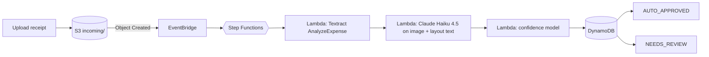
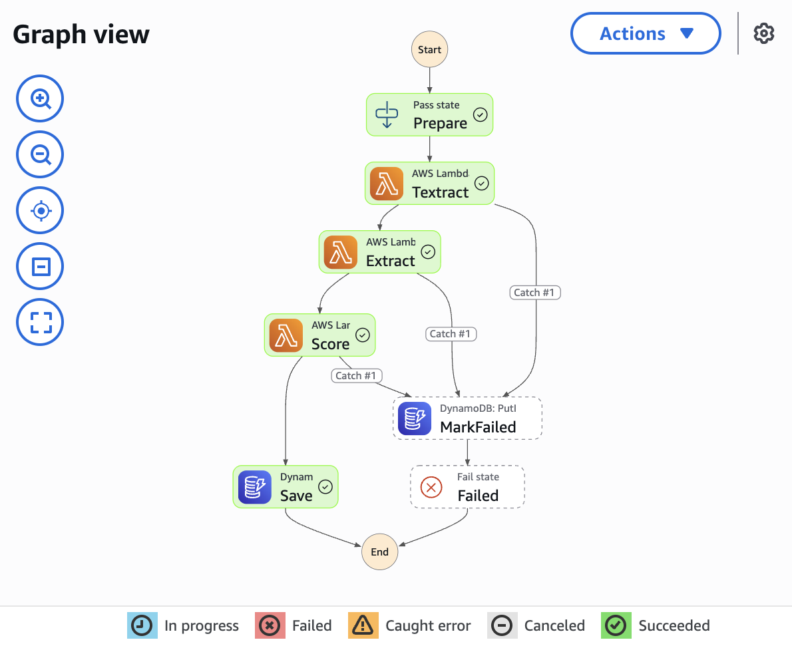
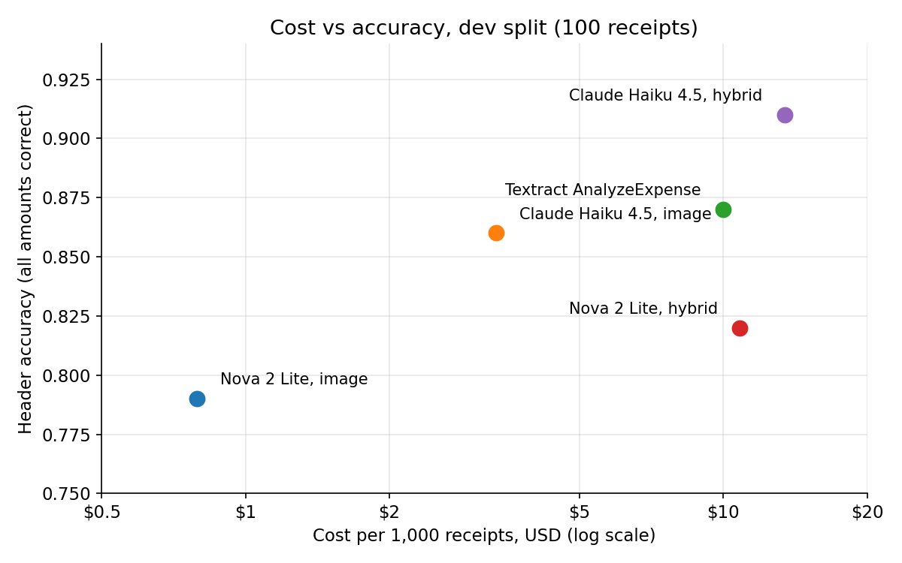
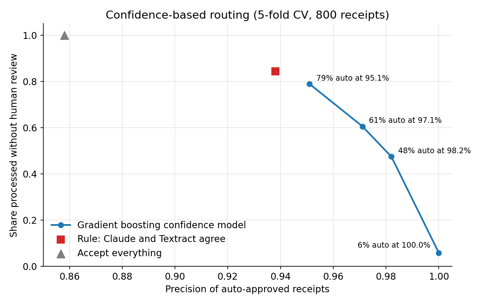

# Receipt extraction on AWS: Textract vs LLMs, with confidence-based routing


This project reads receipt images, extracts the amounts and line items, and decides which receipts can be trusted without a human check. It runs as a serverless pipeline on AWS (Textract, Bedrock, Lambda, Step Functions, DynamoDB), and all infrastructure is defined in Terraform.

The goal was not to show that LLMs beat everything. It was to measure, honestly, where each approach wins, what it costs, and how to combine them.

## Results in short

- **Claude Haiku 4.5 reading the image plus Textract's OCR text gets 63% of receipts fully right** (every amount and every line item) against 55% for Textract alone. On 800 receipts the gain is +8.1 points, 95% bootstrap CI +4.9 to +11.4. On totals, subtotals and tax the two are equal.
- **A gradient boosting confidence model routes each receipt to auto-approval or to a human.** At 98% precision it auto-approves about 47% of receipts, at 95% precision about 79%. Without routing, precision is 86%.
- **The deployed pipeline matches offline evaluation exactly** on 100 held-out receipts: 46% auto-approved at 97.8% precision, header accuracy 85%.
- **Cost ranges from $0.79 to about $13.40 per 1,000 receipts** depending on the method. Upload to decision takes about 10 seconds.

## Architecture





A few design decisions worth mentioning:

- **Intermediate results live in S3, not in the workflow state.** Step Functions limits state to 256 KB and Textract responses can be larger.
- **Retries are handled by Step Functions and split by error type.** Bedrock throttling gets patient exponential backoff with jitter (up to 5 minutes), the Lambda concurrency limit gets short frequent retries. Waiting costs nothing in Standard workflows because billing is per state transition. The first version failed a third of the documents when 100 receipts arrived at once on a new account with low quotas; the split retry policy fixed that.
- **Nothing fails silently.** Any error is caught and the document is stored with status `FAILED` and the error message.
- **One arm64 container image serves all three Lambdas.** scikit-learn and numpy are pinned to the exact versions used to train the confidence model, since a pickled model can break or quietly change behaviour across versions.

## Data and evaluation setup

**Dataset:** [CORD v2](https://huggingface.co/datasets/naver-clova-ix/cord-v2), receipts from Indonesian shops and restaurants, labelled with line items, subtotal, tax and total.

**Splits:**

| Split | Receipts | Used for |
|---|---|---|
| dev | 100 | every prompt and method decision |
| test | 100 | final numbers, evaluated once per finalist |
| train | 800 | confirming results with statistical power, training the confidence model |

**Metrics:** field-level precision, recall and F1 after normalizing amounts (separators, currency prefixes). Line items match on normalized name and price, with a stricter exact version and a fuzzy one (price exact, name similarity at least 0.8). *Header accuracy* is the share of receipts with all three amounts right, *full accuracy* additionally needs every line item right. Differences between methods are checked with a paired bootstrap on the same receipts.

## Methods compared

| Method | How it works |
|---|---|
| `textract` | Textract AnalyzeExpense fields only, no LLM |
| `llm_text` | Textract OCR text, then an LLM with forced tool use for structured JSON |
| `llm_layout` | Textract text rebuilt into visual rows from line geometry, then an LLM |
| `llm_image` | Receipt image sent straight to a multimodal LLM |
| `llm_hybrid` | Image and layout text together |

Models: Amazon Nova 2 Lite and Claude Haiku 4.5 on Bedrock. Prompt v1 is generic, prompt v2 adds annotation guidelines found during error analysis.

## Results

### Dev split (100 receipts)

| Method | Model | Prompt | Total F1 | Subtotal F1 | Tax F1 | Items F1 strict / fuzzy | Header acc | Full acc | $ / 1k |
|---|---|---|---|---|---|---|---|---|---|
| textract | - | - | 0.980 | 0.978 | 0.909 | 0.828 / 0.949 | 0.87 | 0.62 | 10.00 |
| llm_text | Nova 2 Lite | v1 | 0.990 | 0.962 | 0.828 | 0.661 / 0.813 | 0.82 | 0.47 | 10.62 |
| llm_layout | Nova 2 Lite | v1 | 0.949 | 0.915 | 0.744 | 0.700 / 0.834 | 0.75 | 0.50 | 10.63 |
| llm_hybrid | Nova 2 Lite | v1 | 0.969 | 0.946 | 0.747 | 0.786 / 0.894 | 0.77 | 0.59 | 10.70 |
| llm_hybrid | Nova 2 Lite | v2 | 0.980 | 0.930 | 0.843 | 0.817 / 0.892 | 0.82 | 0.58 | 10.81 |
| llm_image | Nova 2 Lite | v1 | 0.980 | 0.922 | 0.700 | 0.697 / 0.867 | 0.72 | 0.47 | 0.67 |
| llm_image | Nova 2 Lite | v2 | 0.990 | 0.923 | 0.832 | 0.730 / 0.875 | 0.79 | 0.50 | 0.79 |
| llm_image | Claude Haiku 4.5 | v2 | 0.950 | 0.924 | 0.872 | 0.725 / 0.874 | 0.86 | 0.54 | 3.35 |
| llm_hybrid | Claude Haiku 4.5 | v2 | 0.980 | 0.962 | 0.957 | 0.849 / 0.935 | 0.91 | 0.70 | 13.43 |



### Test split, finalists (100 receipts)

| Method | Model | Total F1 | Subtotal F1 | Tax F1 | Items F1 strict / fuzzy | Header acc | Full acc | $ / 1k |
|---|---|---|---|---|---|---|---|---|
| textract | - | 0.974 | 0.969 | 0.951 | 0.786 / 0.917 | 0.91 | 0.53 | 10.00 |
| llm_image | Nova 2 Lite | 0.897 | 0.929 | 0.761 | 0.753 / 0.905 | 0.73* | 0.51* | 0.79 |
| llm_image | Claude Haiku 4.5 | 0.938 | 0.877 | 0.800 | 0.732 / 0.864 | 0.80 | 0.38 | 3.37 |
| llm_hybrid | Claude Haiku 4.5 | 0.954 | 0.923 | 0.976 | 0.844 / 0.942 | 0.85 | 0.61 | 13.45 |

\* One failed API call in this run was scored as an empty prediction, so these numbers are slightly low.

### Textract vs Claude hybrid on 800 receipts

| | Textract | Claude hybrid | Difference (95% CI) |
|---|---|---|---|
| Header accuracy | 0.861 | 0.858 | -0.004 (-0.030 to +0.022), not significant |
| Full accuracy | 0.549 | 0.630 | **+0.081 (+0.049 to +0.114)** |
| Items F1 strict / fuzzy | 0.789 / 0.913 | 0.824 / 0.929 | |

The two methods fail on different receipts. On dev, 7 receipts were fully right only with Textract and 15 only with Claude, which is why combining them for routing works.

### Confidence-based routing

The model predicts whether Claude hybrid got all amounts right, using only signals available in production:

- agreement between Claude and Textract on each amount and on line items;
- receipt arithmetic (items sum to subtotal, subtotal plus tax equals total);
- Textract's confidence scores for fields and words.

The threshold is picked with 5-fold cross-validation on train, then checked on test.



| Policy | Auto-approved, CV (800) | Precision, CV | Auto-approved, test | Precision, test |
|---|---|---|---|---|
| Accept everything | 100% | 85.8% | 100% | 85.0% |
| Rule: all amounts agree | 84.3% | 93.8% | 89% | 93.3% |
| Gradient boosting, target 95% | 78.9% | 95.1% | 82% | 95.1% |
| Gradient boosting, target 97% | 60.6% | 97.1% | 59% | 98.3% |
| Gradient boosting, target 98% | 47.5% | 98.2% | 46% | 97.8% |
| Gradient boosting, target 99% | 5.9% | 100% | 7% | 100% |

Picking the threshold is a business decision: if a wrong total is expensive, run at 98% and people check half the receipts instead of all of them. If 5% errors are acceptable, people check one in five.

### Production pipeline parity (100 test receipts)

| | Deployed pipeline | Offline evaluation |
|---|---|---|
| Auto-approved | 46.0% | 46% |
| Precision of auto-approved | 97.8% | 97.8% |
| Header accuracy | 85.0% | 85% |

## What didn't work, and what I learned

- **My first hypothesis was wrong.** I expected the LLM on plain OCR text to mix up which price belongs to which item, so I rebuilt rows from Textract's line geometry. It didn't help. Error analysis showed that wrong prices were only 8 of 107 item errors. Most errors were mismatches with labelling conventions: quantities left in item names, toppings extracted as separate items, `PB1-TAX Tax 6,364` returned instead of `6,364`. Writing these conventions into prompt v2 lifted tax F1 from 0.75 to 0.84 for the same model.
- **A win on dev that wasn't real.** On dev, Claude hybrid beat Textract on header accuracy (0.91 vs 0.87). The paired bootstrap said the difference was not significant, on test it reversed (0.85 vs 0.91), and on 800 receipts the two were equal. Only the full-accuracy gain held on all three splits.
- **Logistic regression could not reach 97% precision.** When Textract finds no tax field its confidence is recorded as 0, and a linear model confuses "no tax on the receipt" with "low confidence". Gradient boosting separates these cases on its own.
- **Nova 2 Lite in hybrid mode** costs more than Textract and scores lower, so it was dropped.
- **Label noise caps precision near 98%.** Some "errors" are wrong labels, for example `REDBEAN BRE/D` in the label against the model's `REDBEAN BREAD`, or receipts with a printed total that the label leaves empty.
- **Run-to-run variance is real.** Two identical runs at temperature 0 differed by 1 to 2 points, so differences of that size on 100 receipts mean nothing.
- **Throttling bit twice.** First, boto3's shared retry budget drained on a long run and half of 800 receipts failed instantly, which I fixed with an explicit backoff loop. Then the deployed pipeline failed a third of a 100-receipt burst, fixed with per-error retry policies in Step Functions.

## Cost

| Method | $ per 1,000 receipts |
|---|---|
| Nova 2 Lite, image | 0.79 |
| Claude Haiku 4.5, image | 3.37 |
| Textract AnalyzeExpense | 10.00 |
| Claude Haiku 4.5, hybrid (Textract + LLM) | 13.45 |

The whole project, including every experiment, cost under $20 of AWS credits. At rest the deployed stack costs pennies per month: Lambda, Step Functions and on-demand DynamoDB have no idle cost, only S3 and ECR storage remain.

## Repository layout

```
infra/                  Terraform: S3, ECR, Lambda, Step Functions, DynamoDB, EventBridge
src/idp/
  extract.py            Bedrock Converse with forced tool use, prompt versions, backoff
  ocr.py                Textract AnalyzeExpense, caching, layout text, baseline mapping
  metrics.py            field-level metrics, strict and fuzzy item matching
  features.py           confidence model features
  pipeline.py           Lambda handlers
scripts/
  prepare_cord.py       download and convert the dataset
  run_eval.py           evaluate a method on a split (supports --retry of failed documents)
  inspect_errors.py     break down errors by field and type
  significance.py       paired bootstrap comparison of two runs
  train_confidence.py   train and evaluate the routing model
  build_and_push.sh     build the Lambda image and push it to ECR
  pipeline_demo.py      send receipts through the deployed pipeline and score the results
```

## Reproduce

```bash
python -m venv .venv && source .venv/bin/activate
pip install -e ".[dev]"
pytest

export AWS_REGION=eu-west-2
terraform -chdir=infra init
terraform -chdir=infra apply -target=aws_s3_bucket_public_access_block.data -target=aws_ecr_repository.pipeline
export IDP_BUCKET="$(terraform -chdir=infra output -raw bucket_name)"

# Experiments
python scripts/prepare_cord.py --splits dev,test,train
python scripts/run_eval.py --split dev --method textract
python scripts/run_eval.py --split dev --method llm_hybrid --model claude-haiku-4.5 --prompt v2 --workers 1
python scripts/compare_runs.py
python scripts/significance.py textract llm_hybrid:claude-haiku-4.5:v2

# Confidence model (needs train and test runs of both methods)
python scripts/train_confidence.py --target header --precision 0.98

# Pipeline
./scripts/build_and_push.sh
terraform -chdir=infra apply
aws s3 cp results/confidence/<run>/models.joblib "s3://$IDP_BUCKET/models/confidence.joblib"
python scripts/pipeline_demo.py --n 10
```

## Limitations and next steps

- One public dataset of Indonesian receipts. Invoices, multi-page documents and other layouts are untested.
- Routing is per document. Sending only the doubtful field to a reviewer would save more human time.
- There is no review UI yet. `NEEDS_REVIEW` items wait in DynamoDB.
- Under heavy bursts the pipeline relies on retries. At larger scale an SQS buffer with controlled concurrency would be the next step.
- A cheap third opinion (Nova 2 Lite on the image, about $0.79 per 1,000) might raise the auto-approval rate further.
